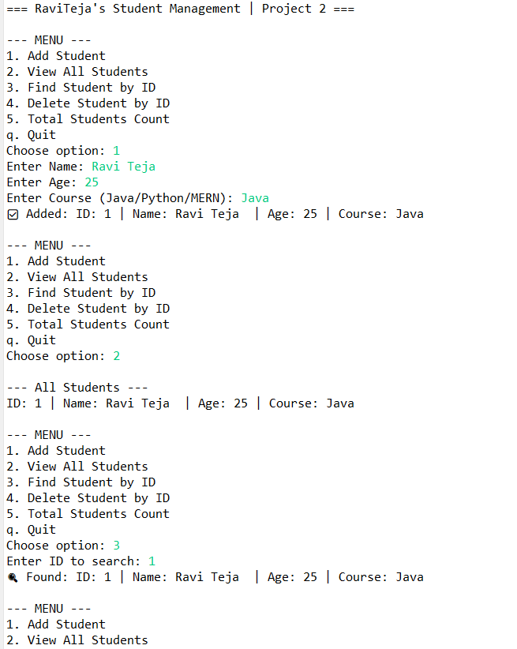
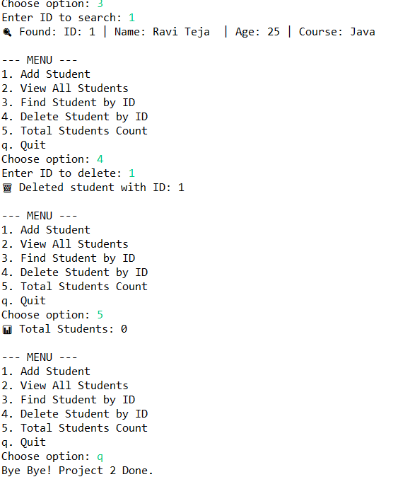

 # 🎓 Project 02 - Student Management System | Java 100 Projects

  

> Day 2 of my 100 Java Projects Challenge towards 9 LPA!

A console-based CRUD application to manage students using Java Collections, Streams and Custom Exceptions.

### ✨ Features
- ✅ Add Student with Auto-Increment ID
- 📋 View All Students
- 🔍 Find Student by ID using Stream API
- 🗑️ Delete Student by ID
- 📊 Total Count
- Custom Exception Handling

### 🛠️ Tech Stack
- Java 21 (JDK 21.0.10)
- ArrayList, Java Streams, OOP
- Eclipse IDE, Git & GitHub, Maven

### 🚀 How to Run
```bash
git clone https://github.com/raviteja-dev950/02-student-management.git
cd 02-student-management
# Open in Eclipse -> Run Main.java

### 📸 Demo


